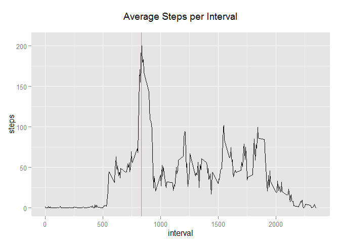

# Reproducible Research: Peer Assessment 1


### Loading and preprocessing the data

Load the activity.csv file from the /data/ folder in your working directory.


```r
        # Read Activity csv file
        data<-read.csv(file = './data/activity.csv')

        # Convert data column from factor to Date.
        data$date<-as.Date(data$date)

        dataCompleteCases<-data[complete.cases(data),]
```


### What is mean total number of steps taken per day?


```r
        # aggregate interval level steps data to daily totals
        aggregate<-aggregate(steps ~ date, data=data, sum)
        
        # calculate the mean steps per day using hte aggregate data
        mean(aggregate[,2])
```

```
## [1] 10766
```

```r
        # calculate the median steps per day using hte aggregate data
        median(aggregate[,2])
```

```
## [1] 10765
```

```r
        # Use ggplot2 package for graphing
        library(ggplot2)
```

```
## Warning: package 'ggplot2' was built under R version 3.1.1
```

```r
        # Create simple bar chart showing total steps per day.
        qplot(x=date, y=steps, stat='identity', data=aggregate, geom="bar") + geom_hline(aes(yintercept=mean(aggregate[,2])), colour="#990000", linetype="dashed") + ggtitle("Total Steps per Day\n")
```

 


### What is the average daily activity pattern?


```r
        interval_aggregate<-aggregate(steps ~ interval, data=data, mean)

        max_steps_interval<-interval_aggregate[interval_aggregate$steps==max(interval_aggregate$steps),]$interval
        print(paste("Interval with highest average stesp = ", max_steps_interval))
```

```
## [1] "Interval with highest average stesp =  835"
```

```r
        print("Shown as red vertical line in the line graph below")
```

```
## [1] "Shown as red vertical line in the line graph below"
```

```r
        qplot(x=interval, y=steps, stat='identity', data=interval_aggregate, geom="line") + geom_vline(aes(xintercept=835, colour="#990000", linetype="dashed")) + ggtitle("Average Steps per Interval\n")
```

 


### Imputing missing values  
I have chosen the impute missing values by replacing the empty step values with mean steps for that interval.
    

```r
        # Count the number of missing steps values
        numberOfEmptyValues<-sum(is.na(data$steps))
        print(paste("Number of missing vlaues = ", numberOfEmptyValues))
```

```
## [1] "Number of missing vlaues =  2304"
```


```r
        # Copy the raw data to a new new data frame dataImputationResult to hold the imputation results
        dataImputationResult<-data

        #
        # Impute Missing Steps Values with Mean for Interval
        #
        for (i in seq_along(dataImputationResult[,1])) {
        
                if (is.na(dataImputationResult[i,]$steps)){
                        dataImputationResult[i,]$steps<-interval_aggregate[interval_aggregate$interval==dataImputationResult[i,]$interval,2]                
                } 
        }
```


```r
        # calculate the total steps per day for the data with imputation results
        imputationAggregate3<-aggregate(steps ~ date, data=dataImputationResult, sum)

        # plot a bar graph of total steps per day
        qplot(x=date, y=steps, stat='identity', data=imputationAggregate3, geom="bar") + geom_hline(aes(yintercept=mean(imputationAggregate3[,2])), colour="#990000", linetype="dashed")
```

 

```r
        # calculate the mean steps per day based on the aggregate data
        mean(imputationAggregate3[,2])
```

```
## [1] 10766
```

```r
        # calculate the median steps per day based on the aggregate data
        median(imputationAggregate3[,2])
```

```
## [1] 10766
```


### Are there differences in activity patterns between weekdays and weekends?


```r
        # Use the weekdays function to label rows as weekend day (TRUE or FALSE)
        dataImputationResult$weekend<-data.frame(col1=ifelse((weekdays(dataImputationResult$date) %in% c('Saturday','Sunday')), TRUE, FALSE))$col1

        # produce a data frame of weekday results
        weekdayData<-dataImputationResult[dataImputationResult$weekend==FALSE,]

        # produce a data frame of weekend results
        weekendData<-dataImputationResult[dataImputationResult$weekend==TRUE,]

        # aggregate the weekday steps by 5 minute interval
        meanStepsByIntervalWeekdays<-aggregate(weekdayData$steps~weekdayData$interval,data=weekdayData,FUN=mean)

         # aggregate the weekend steps by 5 minute interval
        meanStepsByIntervalWeekend<-aggregate(weekendData$steps~weekendData$interval,data=weekendData,FUN=mean)

        # produce the panel line charts in a grid of 2 rows and 1 column
        par(mfrow=c(2,1))
        plot(meanStepsByIntervalWeekend,type="l",main="weekend",xlab="5 minute interval",ylab="Mean Steps")
        plot(meanStepsByIntervalWeekdays,type="l",main="weekdays",xlab="5 minute interval",ylab="Mean Steps")
```

 
